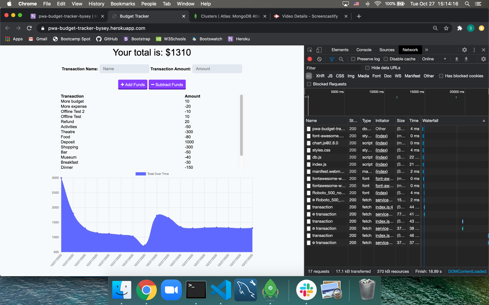
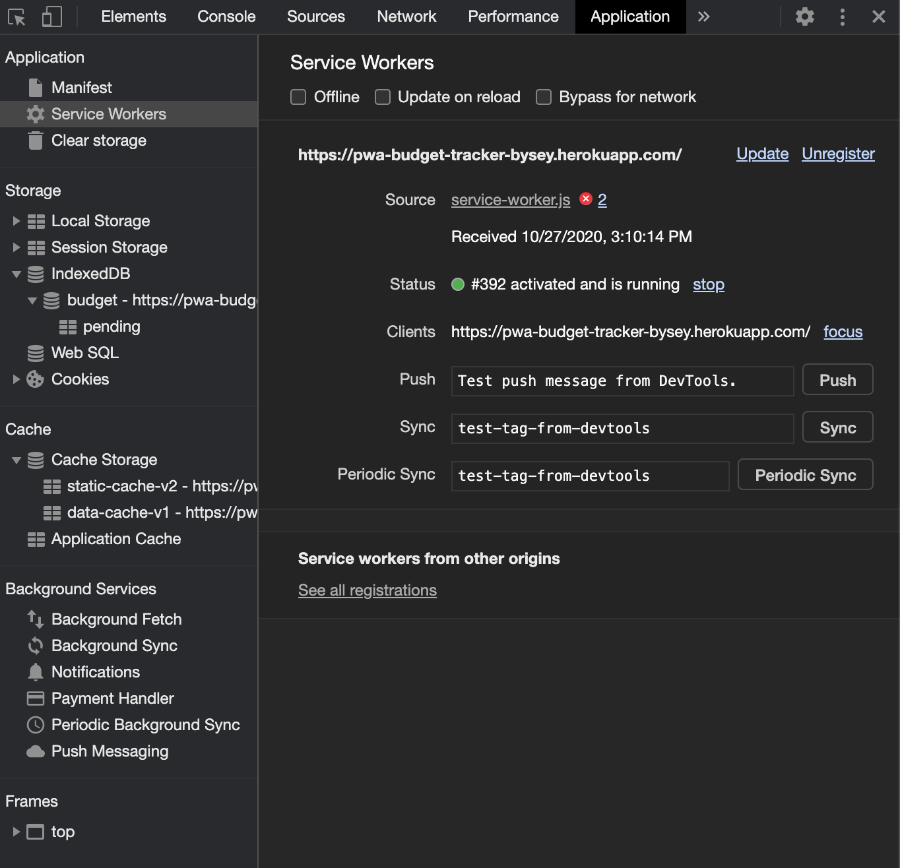

# Progressive Web Applicatiobn -- Budget Tracker
[](https://opensource.org/licenses/ISC)

## Description

Adding offline functionality to existing budget tracker using IndexedDB for offline storage and setting Cache to store css and html of app (static-cache) and store transaction data (data-cache) through the service worker. 

## Screenshot Previews

Live demo of app in offline mode then turned online to repopulate data






## Installation

#### For local deploy
1. Check package.json for dependenscies and in the terminal install node modules.
2. Once modules installed, run server.js
3. Make sure that app is listening and then open chrome browser to localhost:3000
```shell
npm install

node server.js
```
#### For heroku deploy
- Click the link provided in [Links](#Links)

## Usage

- User can view Budget Tracker graph to see all expenses and funds
- User can add funds
- User can subract expenses
- User is able to use app online to keep track of budget
- When user goes back online, the offline budget data is then shown in the list included in overall data 
- User can see line graph activity throughout all budget addition and subtractions

## Attributes

* Compression
* Express
* Mongoose
* Morgan
* IndexedDB
* Service Workers
* Cache
* Webmanifest

## Links
Heroku link - <a href="https://pwa-budget-tracker-bysey.herokuapp.com/" target="_blank">https://pwa-budget-tracker-bysey.herokuapp.com/</a>

## License
ISC License

---
Copyright Ⓒ 2020 Seychelle Koplik
